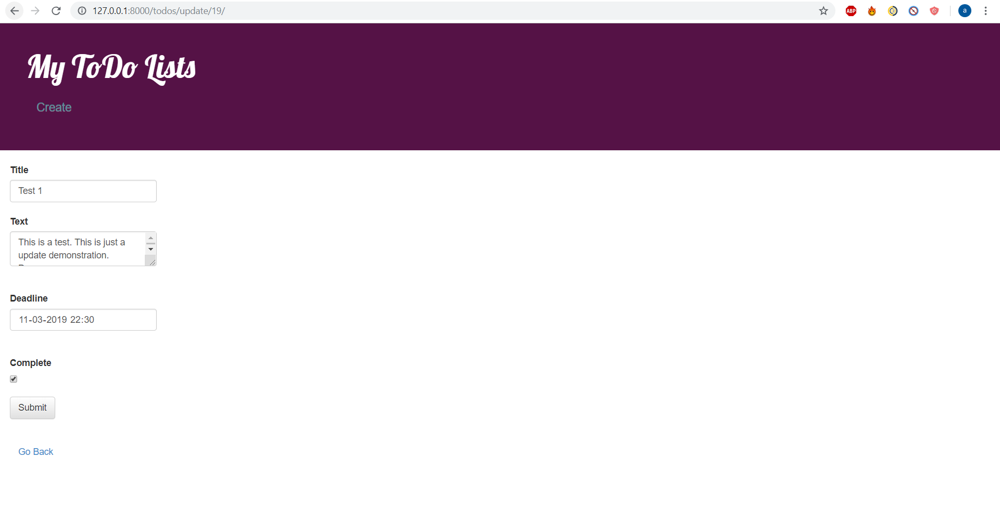

This is a todo web app created in Django.

1. It uses postgreSQL as the database at the backend
2. It provides api for adding,deleting,updating and viewing the users todo lists.
3. It also mails the user once deadline is reached.
4. It has a simple user interface written in html and css using bootstrap.
5. Message is shown if non-completed tasks are approaching within the next 10 hours.

This app has been created for a single user but can be extended to cater to multiple users without much difficulty.

postgreSQL setup(if needed to run on local machine) providing steps to setup postgreSQL in anaconda:
1. download postgres for anaconda
2. run the following commands :  
initdb -D /path/to/db     
postgres -D /path/to/db
3. In a seperate terminal run createdb  
4. Then you can use psql command line interface to create a user and view databases and tables.

Now to run the app:-
1. Install the required dependencies.
2. Execute python manage.py makemigrations
3. Execute python manage.py migrate
4. Execute pyhton manage.py runserver

You can view the images I have uploaded for each page if incase you are unable to run the app.
Thank you

home page

create page

update page

Postgres database running

